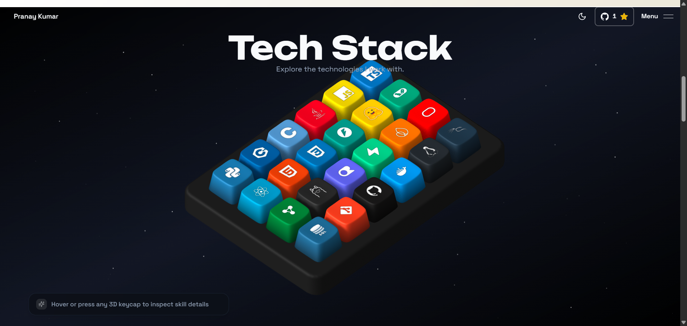

# Pranay Kumar Vonamala — Portfolio

> Interactive 3D portfolio showcasing AI/ML, software engineering, information security, projects, experience, and technical work.

[](https://pranay-portfolio-alpha.vercel.app)
[](https://github.com/Pranay-Kumar-02)
[](https://www.linkedin.com/in/pranay-kumar-vonamala/)
[](LICENSE)



---

## Overview

This repository contains the source code for the personal engineering portfolio of **Pranay Kumar Vonamala**. Designed to present high-impact technical work, the application integrates an interactive 3D Spline technology keyboard, physics-driven animations, comprehensive technical project breakdowns, work experience, education history, and direct communication channels.

The website delivers a high-performance experience with zero-latency mechanical keyboard interaction, curated monochrome aesthetics, and production-grade responsive design across all viewports.

---

## Highlights

- **Interactive 3D Technology Keyboard**: Real-time 3D mechanical keyboard rendered via Spline with physics-based tactile keycap depression and low-latency acoustic feedback.
- **24-Key Verified Technology Mapping**: Custom 6×4 matrix featuring Pranay's exact engineering stack with high-contrast vector brand assets and 2D telemetry inspect cards.
- **Smooth Inertial Scrolling**: Unified framerate-synced scrolling driven by Lenis and GSAP ScrollTrigger ticker integration.
- **Multi-Layered Animations**: Kinetic section reveals, stagger transitions, and modal dialogs powered by Framer Motion and GSAP.
- **Detailed Project Showcases**: Architectural deep-dives with problem statements, engineering solutions, technical highlights, and live demo links.
- **Monochrome Experience Timeline**: High-contrast black-and-white card design displaying professional internship experience and academic milestones.
- **Integrated Resume System**: In-browser PDF resume viewer and instant download pipeline.
- **Production Contact Pipeline**: Secure contact form with server-side validation and email delivery via Resend.
- **Adaptive Theme System**: Native dark and high-illumination modes with persistent preferences and zero layout shifts.

---

## Tech Stack

### Core Framework & Runtime
- **Next.js 16.2.2** (App Router, Turbopack, Server Actions)
- **React 19.2.4**
- **TypeScript 5**

### 3D Graphics & Animations
- **@splinetool/runtime & @splinetool/react-spline** (Interactive 3D keyboard scene)
- **GSAP 3.12.5 & @gsap/react** (Coordinate tweens, ScrollTrigger scene orchestration)
- **Motion (Framer Motion) 12.23.24** (UI component transitions and reveals)
- **Lenis 1.1.6** (Inertial smooth scrolling)

### UI & Styling
- **Tailwind CSS 3.4.1** & **tailwindcss-animate**
- **Radix UI** primitives (Dialog, Dropdown, Popover, Tooltip, Scroll Area)
- **Lucide React** & **React Icons** (Vector iconography)
- **Canvas Confetti** (Interactive micro-interactions)

### Backend Services & Form Validation
- **Resend 4.0.0** (Transactional email handling)
- **Zod 3.23.8** (Schema validation)

---

## Portfolio Content

The application is structured into focused sections:

1. **Hero**: Visual introduction and mission statement with quick navigation triggers.
2. **Tech Stack**: Interactive 24-key 3D mechanical keyboard with real-time inspection of languages, frameworks, AI/ML tools, databases, and DevOps tools.
3. **About**: Technical background, engineering philosophy, and focus areas across AI/ML and systems security.
4. **Experience**: Professional journey and academic accomplishments formatted in clean monochrome cards.
5. **Projects**: Detailed case studies of production and research software systems with architectural documentation.
6. **Resume**: Integrated PDF view and direct download of the official curriculum vitae.
7. **Contact**: Direct communication form connected to Resend with instant delivery.

---

## Featured Projects

### 1. Spendly — AI Personal Finance & Predictive Budgeting
- **Stack**: React, Tailwind CSS, Recharts, Framer Motion, Python, FastAPI, Firebase Firestore, OpenRouter LLMs
- **Overview**: AI-powered personal finance platform providing real-time expense tracking, automated budget allocation, predictive cash-flow forecasting, and conversational financial assistance.
- **Engineering Highlights**:
  - Sub-second balance and transaction synchronization across user sessions using Firebase Firestore.
  - Analytics microservice computing monthly spending velocity, runway projections, and categorized cash outflow.
  - Contextual financial recommendations with bounded system prompts guarding financial rationale.
- **Links**: [Live Demo](https://spendly-eosin.vercel.app) • [GitHub Repository](https://github.com/Pranay-Kumar-02/spendly)

### 2. Sentinel AI — Cyber Threat Intelligence & SOC Telemetry
- **Stack**: React, Tailwind CSS, Recharts, Python, FastAPI, VirusTotal API, WHOIS OSINT, Explainable AI
- **Overview**: Automated cybersecurity triage platform ingesting network events, endpoint logs, and Indicators of Compromise (IOCs) to classify threat severity and correlate external threat intelligence.
- **Engineering Highlights**:
  - Parallelized intelligence ingestion across VirusTotal and WHOIS endpoints with resilient caching.
  - Explainable AI triage generating human-readable feature correlation scores for SOC teams.
  - Cryptographic hash deduplication and persistence for malicious payloads and domains.
- **Links**: [GitHub Repository](https://github.com/Pranay-Kumar-02/sentinel-ai)

### 3. SupportFlow AI — Agentic Support Graphs & Local RAG
- **Stack**: Python, LangGraph, LangChain, RAG Systems, SQLite (WAL), Ollama Local LLMs, React, Tailwind CSS
- **Overview**: Customer support automation platform built with stateful cyclic agent graphs, local retrieval-augmented generation (RAG), and zero cloud data egress.
- **Engineering Highlights**:
  - Stateful LangGraph supervisor dynamically routing inquiries across specialized sub-agents (Technical, Billing, Sales).
  - 100% offline, privacy-preserving execution utilizing open-weight LLMs served via Ollama.
  - SQLite conversational checkpoints enabling state rollback, inspection, and session resumption.
- **Links**: [GitHub Repository](https://github.com/Pranay-Kumar-02/supportflow-ai)

### 4. Textora Engine — Video-to-Text & Dataset Engineering
- **Stack**: Python, FastAPI, faster-whisper, SQLite WAL, xxHash64, SHA-256, Data Lineage DAGs, React, shadcn/ui
- **Overview**: Multimodal video-to-text platform turning raw audio and video sources into validated, reproducible, and provenance-aware training datasets.
- **Engineering Highlights**:
  - Caption-first dual ingestion evaluating existing subtitles before falling back to local Whisper models.
  - Deterministic n-gram sliding window normalizer stripping rolling subtitles and non-lexical audio noise.
  - Cryptographic SHA-256 data lineage tracking all transformations from source URL to training corpus.
- **Links**: [GitHub Repository](https://github.com/Pranay-Kumar-02/textora-engine)

---

## Experience & Education

### Experience
- **10X Technologies** — *AI/ML & Full-Stack Developer Intern* (Aug 2026 – Oct 2026)
  - Contributed to AI/ML and software engineering initiatives involving production AI models, LLMs, and RAG systems.
  - Developed AI workflows using Hugging Face transformer models and LangChain for structured retrieval.
  - Engineered robust REST API microservices, request validation pipelines, and data models with FastAPI.
  - Built responsive UI components, telemetry views, and interactive data visualizations.

### Education
- **Vellore Institute of Technology (VIT), Vellore**
  - **Degree**: Bachelor of Technology (B.Tech) in Computer Science & Engineering
  - **Specialization**: Information Security
  - **Academic Standing**: Current CGPA: **8.27 / 10.0** (2024 – 2028)
  - **Core Coursework**: Data Structures & Algorithms (C++), Object-Oriented Programming (Java), Database Management Systems (DBMS), Operating Systems, Computer Networks, and Information Security.
  - **Credentials**: IBM SkillsBuild (Cybersecurity), IBM Career (Building Agents with Agentic AI), Deloitte (Cyber Job Simulation), IIT Madras (Cyber Ninjas with Ethical Hacking).

---

## Project Structure

```text
pranay-kumar-portfolio/
├── public/
│   ├── assets/
│   │   ├── backgrounds/               # High-res project background textures
│   │   ├── keycap-sounds/             # Mechanical switch audio assets
│   │   ├── logos/                     # Partner and brand masks
│   │   ├── nav-link-previews/         # Hover navigation preview renders
│   │   ├── projects-screenshots/      # Full-scale project interface captures
│   │   ├── seo/                       # Open Graph and meta images
│   │   ├── skills/                    # Verified 24-skill vector SVG icons
│   │   ├── portfolio-preview.png      # Portfolio hero documentation graphic
│   │   └── skills-keyboard.spline     # Custom baked 3D keyboard scene
│   └── Pranay_Kumar_Vonamala_Resume.pdf
├── src/
│   ├── actions/                       # Next.js Server Actions (e.g. GitHub star counters)
│   ├── app/                           # App Router routes, layouts, and API endpoints
│   │   ├── api/
│   │   │   ├── collect/               # Telemetry and diagnostics endpoint
│   │   │   └── send/                  # Resend contact form delivery handler
│   │   ├── blogs/                     # MDX-based technical writing
│   │   ├── resume/                    # Embedded PDF resume reader
│   │   ├── globals.css                # Design system tokens and custom utilities
│   │   ├── layout.tsx                 # Root layout, metadata, and fonts
│   │   └── page.tsx                   # Main single-page interactive experience
│   ├── components/                    # Modular UI components
│   │   ├── footer/                    # Site footer, social links, and status indicator
│   │   ├── realtime/                  # Audio engines and sensory feedback hooks
│   │   ├── sections/                  # Hero, Skills, Experience, Projects, Contact
│   │   ├── theme/                     # Theme toggles and notification toasts
│   │   ├── ui/                        # Radix UI and Tailwind design primitives
│   │   └── animated-background.tsx    # Spline WebGL controller & GSAP timelines
│   ├── content/                       # Technical blogs and MDX posts
│   ├── contexts/                      # React context providers
│   ├── data/
│   │   ├── config.ts                  # Centralized identity, metadata, and social links
│   │   ├── constants.ts               # 24-skill definitions, palette tokens, and experience
│   │   └── projects.tsx               # Technical project specifications and architecture
│   ├── hooks/                         # Custom React hooks (performance profiles, viewports)
│   ├── lib/                           # Utility helpers, active skill signals, and client singletons
│   ├── types/                         # TypeScript interfaces and type definitions
│   └── utils/                         # String and DOM formatting utilities
├── .env.example                       # Reference environment configuration
├── package.json                       # Project manifests and scripts
├── tailwind.config.ts                 # Tailwind design configuration
└── tsconfig.json                      # Strict TypeScript compiler options
```

---

## Local Development

### Prerequisites

- **Node.js**: `v18.18.0` or higher (Node 20+ recommended)
- **Package Manager**: `npm` (or `pnpm`)

### Setup Instructions

1. **Clone the repository**:

   ```bash
   git clone https://github.com/Pranay-Kumar-02/pranay-kumar-portfolio.git
   cd pranay-kumar-portfolio
   ```

2. **Install dependencies**:

   ```bash
   npm install
   ```

3. **Configure environment variables**:

   Create a `.env.local` file from the provided template:

   ```bash
   cp .env.example .env.local
   ```

4. **Launch development server**:

   ```bash
   npm run dev
   ```

   Navigate to [http://localhost:3000](http://localhost:3000) to view the live site.

5. **Build and test production bundle**:

   ```bash
   npm run build
   npm run start
   ```

---

## Environment Variables

All variables should be defined in `.env.local` for local execution and configured in the project dashboard for production deployments.

| Variable | Required | Description |
|---|---|---|
| `RESEND_API_KEY` | Optional | API key from [Resend](https://resend.com) to enable email delivery from the contact form. |
| `NEXT_PUBLIC_WS_URL` | Optional | WebSocket server endpoint for realtime multiplayer presence and cursors. |
| `UMAMI_DOMAIN` | Optional | Custom self-hosted domain URL for privacy-friendly Umami analytics. |
| `UMAMI_SITE_ID` | Optional | Unique website tracking ID for Umami analytics. |
| `UMAMI_DEPLOY_SITE_ID` | Optional | Website ID for deployment verification telemetry. |
| `NEXT_PUBLIC_LEGACY_HOST` | Optional | Previous domain host to trigger one-time migration notices. |

---

## Deployment

This portfolio is optimized for zero-configuration deployment on **Vercel**:

1. Fork or push this repository to your GitHub account: `https://github.com/Pranay-Kumar-02/pranay-kumar-portfolio`.
2. Navigate to [Vercel Dashboard](https://vercel.com/dashboard) and click **"Add New Project"**.
3. Import the repository `pranay-kumar-portfolio`.
4. Under **Environment Variables**, add `RESEND_API_KEY` and any optional configuration tokens.
5. Click **Deploy**. Vercel will automatically run `npm run build` and provision edge deployments on every push.

---

## Author

**Pranay Kumar Vonamala**  
*Computer Science & Information Security Engineer*

- **Website**: [pranay-portfolio-alpha.vercel.app](https://pranay-portfolio-alpha.vercel.app)
- **GitHub**: [@Pranay-Kumar-02](https://github.com/Pranay-Kumar-02)
- **LinkedIn**: [linkedin.com/in/pranay-kumar-vonamala](https://www.linkedin.com/in/pranay-kumar-vonamala/)
- **LeetCode**: [leetcode.com/u/Pranayyy_](https://leetcode.com/u/Pranayyy_/)
- **Email**: [vonamala.pranay.official@gmail.com](mailto:vonamala.pranay.official@gmail.com)

---

## License

This project is open-source and available under the [MIT License](LICENSE) © 2026 Pranay Kumar Vonamala.
